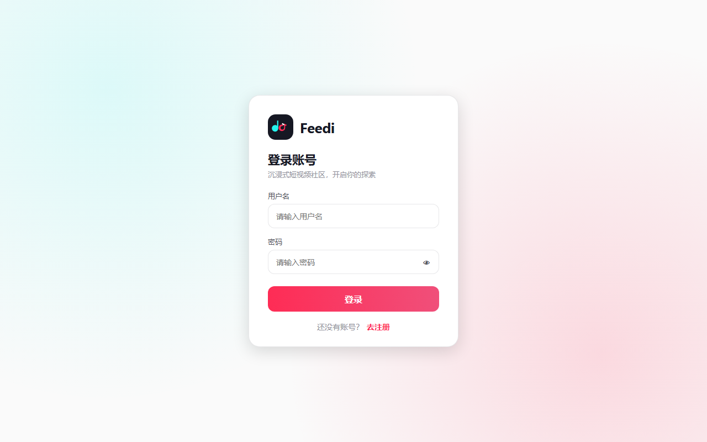
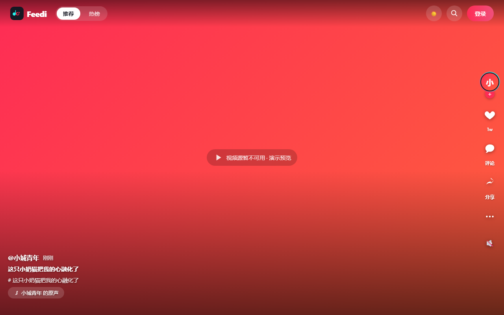
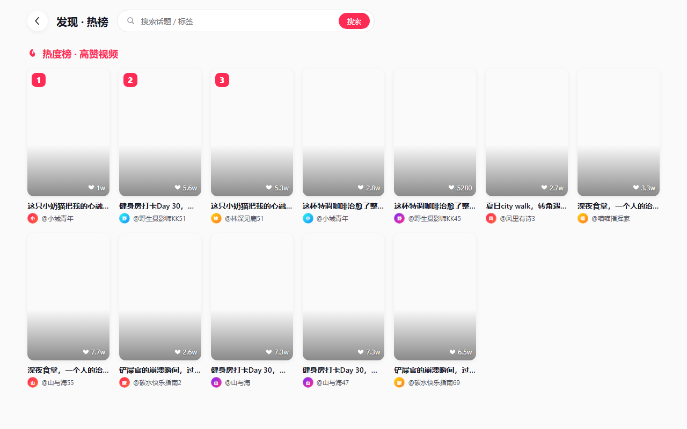
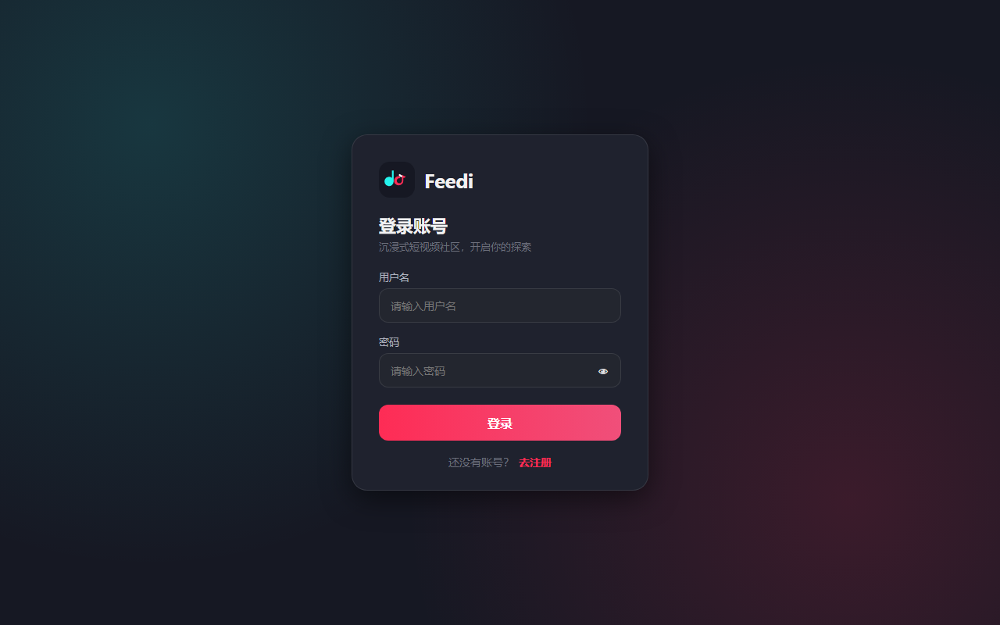

# Feedi · 高并发短视频 Feed 流系统（Go 后端）

> 一个人在做、可以陪面试官一路追问到代码行的练手项目。
> 核心目标不是"写一堆接口"，而是把 **发布 → 进时间线 → 被刷到 → 互动 → 涨热度 → 通知作者** 这条链路做成一个能验证、能量化、能讲清边界的系统。

**作者**：杨大春（2026 届｜西南科技大学 计算机科学与技术 ｜求职方向：Go 后端开发）
**角色**：本人独立完成，负责全部设计、编码、压测与调优。
**License**：Apache-2.0

---

## 目录

- [1. 技术栈](#1-技术栈)
- [2. 系统链路](#2-系统链路)
- [3. 已实现功能](#3-已实现功能)
- [4. 值得讲的技术点](#4-值得讲的技术点)
- [5. 压测与调优（真实数据）](#5-压测与调优真实数据)
- [6. 一致性边界（诚实地写在前面）](#6-一致性边界诚实地写在前面)
- [7. 快速开始](#7-快速开始)
- [8. 接口文档](#8-接口文档)
- [9. 目录结构](#9-目录结构)
- [10. 已知不足与 TODO](#10-已知不足与-todo)

---

## 1. 技术栈

| 分层 | 选型 |
|---|---|
| 语言 / 运行时 | Go 1.25 |
| Web 框架 | Gin |
| 关系型存储 | MySQL 8 + GORM（AutoMigrate 自动建表） |
| 缓存 | Redis（`go-redis/v9`）+ 进程内 `go-cache` 做 L1 |
| 消息队列 | RabbitMQ（`amqp091-go`） |
| 鉴权 | JWT（HS256）+ Redis 会话态 |
| 实时推送 | SSE（Server-Sent Events） |
| ID 生成 | Snowflake（`bwmarrin/snowflake`） |
| 前端 | Vue 3 + TypeScript + Vite + Pinia + Vue Router |
| 压测 | Apache JMeter 5.6.3 |

---

## 2. 系统链路

api 与 worker 是**两个独立进程**，只通过 MySQL Outbox 表 + RabbitMQ 协作：

```
写入侧（同步，强一致）
  发布/点赞/评论/关注 ──► MySQL 本地事务 ──┬──► 业务表
                                          └──► outbox 表（待投递事件）

投递侧（异步，最终一致）
  Outbox 轮询器 ──► RabbitMQ ──► worker 消费者 ──► Redis
                                                 ├─ 全局时间线 ZSET（feed:global_timeline）
                                                 ├─ 点赞数 / 评论数累计
                                                 └─ 分钟热度窗口 ZSET（hot:video:1m:*）

读取侧（多级缓存）
  客户端 ──► L1 go-cache(5s) ──► L2 Redis ──► L3 MySQL
                │                    │              │
           命中即返回          未命中回源       singleflight 合并同 ID 并发回源

实时侧
  通知事件 ──► RabbitMQ ──► Broadcaster ──► SSE Hub（账号 → 在线连接表）──► 浏览器
```

> **为什么用 Outbox**：发布视频时，"视频落库"和"写 Redis 时间线"跨了两种存储，直接双写会出现"库里有、时间线没有"或反之。
> 这里把事件当作数据的一部分写进同一事务的 outbox 表，再由轮询器负责可靠投递，**用本地事务换来跨存储的最终一致性**。

---

## 3. 已实现功能

| 模块 | 能力 |
|---|---|
| 账号 | 注册、登录、双 Token 刷新、登出（服务端真失效）、改资料、改密码、头像上传 |
| 视频 | 发布、详情、删除、封面上传；**分片上传 init → chunk → status → complete**，支持断点续传与相同文件秒传（200MB 上限） |
| Feed | 最新流（时间游标）、关注流（时间游标 + 响应缓存）、热度榜（分钟快照 + offset，降级时复合游标）、点赞数榜（`(likes_count, id)` 复合游标）、标签流 |
| 互动 | 点赞 / 取消、评论 / 删除评论、关注 / 取关、粉丝与关注列表、关注数统计 |
| 通知 | SSE 实时推送（点赞/评论/关注）+ 通知列表游标分页，**双写**（DB 落库 + MQ 驱动推送） |
| 可观测 | `/healthz` 健康检查、pprof 端口、结构化日志（`log/slog`）、完整 Swagger/OpenAPI 文档 |

前端（`front/`）覆盖首页多 Tab Feed、视频详情与评论、个人主页、发布页（含分片上传与进度）、登录注册等页面。

### 界面截图

| 登录 | Feed 流 | 发现页 |
|---|---|---|
|  |  |  |

| 通知中心 |
|---|
|  |

---

## 4. 值得讲的技术点

> 每条都给"做法 → 证据位置 → 边界"，方便按图索骥。

### 4.1 全局时间线：Redis ZSET 做主，MySQL 兜底，冷启动自动重建

- 时间线用 ZSET `feed:global_timeline`，member = 视频 ID，score = 发布时间（毫秒），由 worker 消费视频发布事件后写入，并用 `ZRemRangeByRank` **裁剪保留最新 1000 条**（热数据常驻内存）。
- ZSET 为空（Redis 重启/过期/首次启动）时，走 **singleflight + 全量重建**：只有一个协程去 MySQL 捞最新 1000 条回填 ZSET，其余协程共享结果，避免缓存冷启动把 DB 打穿。
- 游标翻页越过 ZSET 边界（刷到很旧的内容）时自动降级 MySQL 游标查询，做到"热数据在 Redis、冷数据在 DB"的**冷热分离**。
- 证据：`internal/feed/feed_service.go`（`ListLatest`）、`internal/worker/consumer/timeline.go`。

### 4.2 三级缓存 + singleflight + 分布式锁，防击穿也防雪崩

Feed 列表要按 ID 批量取视频实体，热点视频必然被重复请求：

- **L1 进程内** `go-cache（TTL 5s）` → **L2 Redis（MGET 批量）** → **L3 MySQL**；
- L2/L3 回源时对同一个视频 ID 走 `singleflight` 合并并发回源，**同一个 Key 只有一个协程真正查库**，Redis 回填异步进行不阻塞请求；
- Redis 抖动（超时/报错）视为**全部未命中**，直接降级 DB，不让缓存故障放大成接口故障。
- 视频详情另外使用 **Redis 分布式锁 + 自旋等待**：抢到锁的协程回源回填，未抢到的轮询最多 5 次 × 20ms 取结果。
- 证据：`internal/feed/feed_service.go`（`GetVideoByIDs`）、`internal/video/video_service.go`、`internal/utils/redis/redis.go`。

### 4.3 关注流：明确"不做写扩散"，用短 TTL 旁路缓存换零扇出成本

- 关注流以 **DB实时 JOIN 关注关系为事实源**，Redis 只是**旁路缓存**（TTL 60s）。
- 作者发布新视频时不做逐粉丝失效扇出——大 V 场景需要遍历粉丝并 SCAN 删键，成本高且受粉丝表单次上限影响；这里用 **TTL 兜底新视频可见性**：最迟 60s 后出现在粉丝的关注流。
- 首帧用户（缓存 miss + 并发）走分布式锁 + 双检查回填，避免重复回源。
- 证据：`internal/feed/feed_service.go`（`ListByFollowing`，注释里完整记录了取舍理由）。

### 4.4 热度榜：分钟窗口滚动 + 快照保证翻页稳定

- 每次点赞/评论增量写入**分钟级 ZSET** `hot:video:1m:yyyyMMddHHmm`（`ZINCRBY`，窗口 2 小时过期）；
- 读榜时用 `ZUNIONSTORE` **合并最近 60 个分钟窗口**得到近 1 小时热榜快照；
- 关键设计：请求里的 `as_of` 会被 **Truncate 到整分钟**，同一份快照的分页共用同一个时间基准，**榜单在翻页过程中不会抖动**；
- Redis 不可用或快照为空时降级 MySQL，使用 `(热度, 创建时间, ID)` **复合游标**分页，规避"相同热度"导致的重复/漏数据。
- 证据：`internal/feed/feed_service.go`（`ListByPopularity`）、`internal/popularitycache/popularitycache.go`。

### 4.5 写路径的一致性：更新 DB → 失效缓存 → 发 MQ

- 视频内容/点赞计数/热度变更后，统一调用 `InvalidateVideoCache` **同时删除详情缓存和 Feed 实体缓存**——同一份数据的两份拷贝必须一起失效，否则两个读路径会给出互相矛盾的结果。
- Redis 的 Key 模板集中在 `internal/utils/redis/keys.go` 作为**唯一事实来源**（含版本前缀 `v1:`），禁止业务代码手写字符串 Key。
- MQ 消费侧用 `SETNX msg:processed:{messageID}` 做**幂等去重**，RabbitMQ 的重投不会重复累加计数。
- 证据：`internal/utils/redis/keys.go`、`internal/worker/consumer/like.go`、`comment.go`。

### 4.6 分片上传：断点续传 + 相同文件秒传

- 会话状态（分片位图 `UploadedBits`、文件大小、总分片数）存在 Redis（TTL 24h），前端中断后可 `status` 查询已上传分片继续传；
- `init` 阶段用 `accountID + fileHash` 反查已有会话，命中即直接返回 `upload_id` 与已完成分片 —— **同一份文件重复上传无需重新传输**；
- 单文件大小上限 200MB。
- 证据：`internal/chunk/chunk_handler.go`。

### 4.7 鉴权：双 Token + Redis 会话态 + 游客态

- Access Token 短期有效，**Refresh Token 用于无感续期**（正向映射 `accountID → token`，鉴权时比对，实现服务端可踢下线/登出即失效）；
- Feed 浏览类接口使用 `SoftJWTAuth`：**游客可浏览，登录后才附带点赞等个性化字段**，避免把一半流量挡在登录墙外。
- 证据：`internal/utils/jwt/jwt.go`、`internal/middleware/auth.go`。

### 4.8 通知：DB 保证不丢，SSE 只负责"快"

- 通知**同步落库**（与业务操作在同一事务），MQ 只驱动实时推送；即使 SSE/MQ 全挂，用户下次拉列表仍能看全。
- SSE Hub 维护 `账号 → 连接集合`，每条连接 16 条出站缓冲，**满了就丢，绝不阻塞业务写**（实时性尽力而为，可靠性由 DB 兜）；
- 25s 心跳 + `X-Accel-Buffering: no` 防代理缓冲；通知事件同样做幂等去重。
- 证据：`internal/ssehub/ssehub.go`、`internal/ssehub/broadcaster.go`、`internal/notification/`。

### 4.9 连接池调优：一个压测中暴露出来的真实 Bug

见下一节，这是这个项目里我最愿意讲的一段。

---

## 5. 压测与调优（真实数据）

**环境**：本机 Windows，api.exe 与 JMeter 5.6.3 **同机运行**（非隔离部署），4 个接口混合流量（latest / detail / popularity / likes_count 各约 1/4），`limit=10`，携带 JWT。
**完整记录**：[`docs/benchmark.md`](docs/benchmark.md)，测试计划见 `docs/benchmark/feed_loadtest.jmx`。

### 修复前 vs 修复后

| 并发 | 修复前吞吐 | 修复前错误率 | 修复后吞吐 | 修复后错误率 |
|---|---|---|---|---|
| 50 | 1,048 /s | 0.88% | **4,662 /s** | 0% |
| 100 | 612 /s | 6.66% | **4,173 /s** | 0% |

### 修复后延迟（100 并发）

| 接口 | P50 | P99 |
|---|---|---|
| `feed/latest` | 24ms | 53ms |
| `video/detail` | 15ms | 35ms |
| `feed/popularity` | 38ms | 77ms |
| `feed/likes_count` | 9ms | 29ms |

- 100 并发持续 60s：249,971 次请求，**0 错误**。

### 根因与修复

高并发下接口间歇性 500，且空闲约 2 分钟后自愈——一开始像负载瓶颈，实际上不是：

1. `netstat` 发现压测期间有 **12,374 个发往 3306 的 TIME_WAIT**，而本机 TCP 动态端口总量仅 13,977；
2. 根因是 **GORM 默认 `MaxIdleConns=2`**：高并发下连接池无空闲连接可用，疯狂新建 MySQL 短连接，最终端口耗尽 → 建连失败 → 500；
3. 修复：显式配置 `SetMaxOpenConns(100) / SetMaxIdleConns(50) / SetConnMaxLifetime(1h)`，用常驻长连接池消除短连接风暴。
4. 证据：`internal/utils/mysql/mysql.go`。

> 这段经历的价值在于：**连接池参数是隐性的容量开关**，默认值在开发机上从不出问题，一上压力就成了最脆弱的一环；排查路径（现象 → TIME_WAIT 计数 → 端口上限 → 默认参数）比结论更值得讲。

---

## 6. 一致性边界（诚实地写在前面）

| 环节 | 延迟/边界 | 说明 |
|---|---|---|
| 发布 → 出现在 Feed | 约 ≤1s | Outbox 轮询间隔 1s，**最终一致** |
| 关注作者新视频 → 出现在关注流 | ≤60s | 旁路缓存 TTL 兜底，**不做扇出**的代价 |
| 热度榜刷新 | ≤1 分钟 | 分钟窗口 + 快照 TTL 2 分钟 |
| SSE 通知 | 毫秒级 | 尽力而为，缓冲满丢弃；**可靠性由 DB 落库保证** |
| 计数类字段 | 最终一致 | MQ 消费者幂等重放可自愈 |

已知边界：时间线翻页使用**毫秒时间戳游标**，极端情况下同一毫秒内并发发布的视频可能漏 1 条（单机极低概率，复合 `(time, id)` 游标改造见 TODO）。

---

## 7. 快速开始

### 依赖

本机需要 MySQL（3306）、Redis（6379）、RabbitMQ（5672）。

### 后端

```bash
# 配置：按需修改 backend/configs/config.yaml
# 数据库无需提前建：启动时会 EnsureDatabase + AutoMigrate

# 方式一：一键拉起 api + worker（推荐，日志在 backend/.run/logs）
./dev.sh start          # stop / restart / status / logs 同样支持

# 方式二：手动启动（注意工作目录必须是 backend/，config.yaml 与上传目录相对它）
cd backend
go run ./cmd/api        # HTTP 服务，默认 :9000
go run ./cmd/worker     # MQ 消费者：timeline / like / comment / popularity
```

> ⚠️ **api 和 worker 必须同时运行**。只跑 api 会导致事件堆积在队列里，全局时间线/热度/计数都不会更新。

健康检查：`curl http://localhost:9000/healthz` → `{"status":"ok"}`

### 前端

```bash
cd front
npm install
npm run dev
```

---

## 8. 接口文档

- 完整契约：[`docs/API.md`](docs/API.md)
- OpenAPI：[`docs/swagger.yaml`](docs/swagger.yaml)（可直接导入 Apifox / YApi / Swagger UI）

路由统一前缀 `/api/v1`，主要分组：

```
account      POST /register /login /refresh /info /username
             POST(鉴权) /logout /rename /password /profile /avatar
feed         POST /latest /following /popularity /likes_count /tag   （软鉴权，游客可看）
video        POST /detail                                            （软鉴权）
             POST(鉴权) /publish /upload /cover /delete /likes_count/update
             POST(鉴权) /upload/init /upload/chunk /upload/status /upload/complete
like         POST(鉴权) /action /unlike /is_liked /my_videos
comment      POST /list                                              （游客可看）
             POST(鉴权) /publish /delete
social       POST(鉴权) /follow /unfollow /followers /vloggers /counts /is_following
notification GET(鉴权)  /stream                                      （SSE 长连接）
             POST(鉴权) /list
```

---

## 9. 目录结构

```
feed/
├── backend/
│   ├── cmd/
│   │   ├── api/            # HTTP 进程入口：依赖装配、路由注册、优雅退出
│   │   └── worker/         # 消费进程入口：timeline/like/comment/popularity 消费者
│   └── internal/
│       ├── account/        # 账号（注册/登录/双 Token/资料）
│       ├── video/          # 视频发布、详情、Outbox 仓库
│       ├── feed/           # 最新流 / 关注流 / 热度榜 / 标签流
│       ├── like/ comment/ social/
│       ├── notification/   # 通知服务与列表
│       ├── ssehub/         # SSE 连接表 + 广播器
│       ├── chunk/          # 分片上传会话（断点续传/秒传）
│       ├── popularitycache/# 分钟热度窗口
│       ├── middleware/     # JWT 硬鉴权 / 软鉴权
│       └── utils/          # mysql / redis / rabbitmq / jwt / snowflake / outboxpoller
├── docs/                   # API.md、swagger.yaml、压测记录
├── front/                  # Vue 3 + TS + Vite 前端
├── dev.sh                  # 一键启停 api + worker
└── README.md
```

分层约定：`handler → service → repository`，每层面向接口编程（如 `AccountRepositoryer`），上层不依赖具体实现。

---

## 10. 已知不足与 TODO

按优先级排列，也是这个项目继续往"生产可用"推进的方向：

1. **SSE Hub 是单实例内存结构**：api 多副本部署时，连接只落在其中一台实例上。下一步引入 Redis Pub/Sub 或 MQ fanout 做跨实例广播。
2. **缺少自动化测试**：目前无单元测试/集成测试，回放与重构安全性依赖手工验证。计划补齐 service 层表驱动单测 + 关键链路集成测试。
3. **热度榜 `ZUNIONSTORE` 存在重复计算**：快照生成缺少互斥，同一分钟的并发请求可能重复聚合 60 个窗口，需要改成"单飞 + 版本化快照 Key"。
4. **毫秒时间戳游标**：极端并发下可能漏数据，计划改成 `(create_time, id)` 复合游标（MySQL 侧已用于热度榜降级路径）。
5. **文件存储是本地磁盘**：`.run/uploads` 不可水平扩展，应替换为对象存储（S3/MinIO/COS）+ CDN，并把分片会话改为服务端合并而非本地合并。
6. **ID 生成**：Snowflake 的节点 ID 目前由各进程硬编码分配，缺少外部协调；多副本场景需要引入节点注册（Redis/etcd）避免 ID 冲突。
7. **推荐算法缺位**：`/feed/latest` 是"最新"而非"推荐"，未实现召回/排序/兴趣画像，也没有负反馈与打散策略。

---

<sub>README 中所有性能指标均来自本机压测（JMeter 与 api 同机），只能作为**相对优化幅度**的参考，不等于生产容量。</sub>
